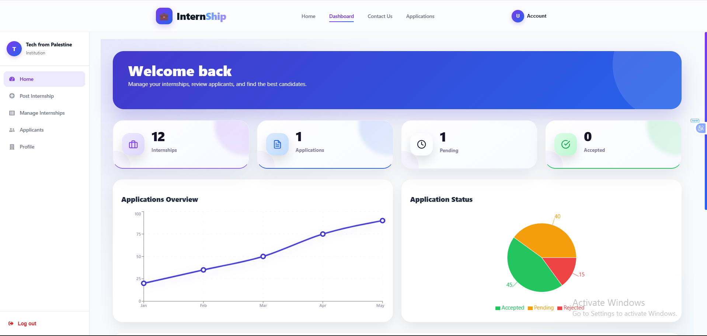
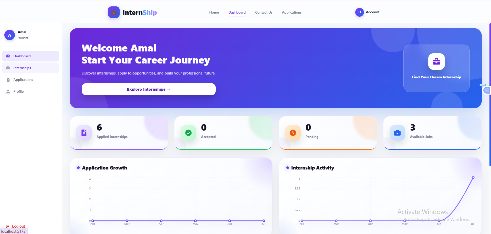
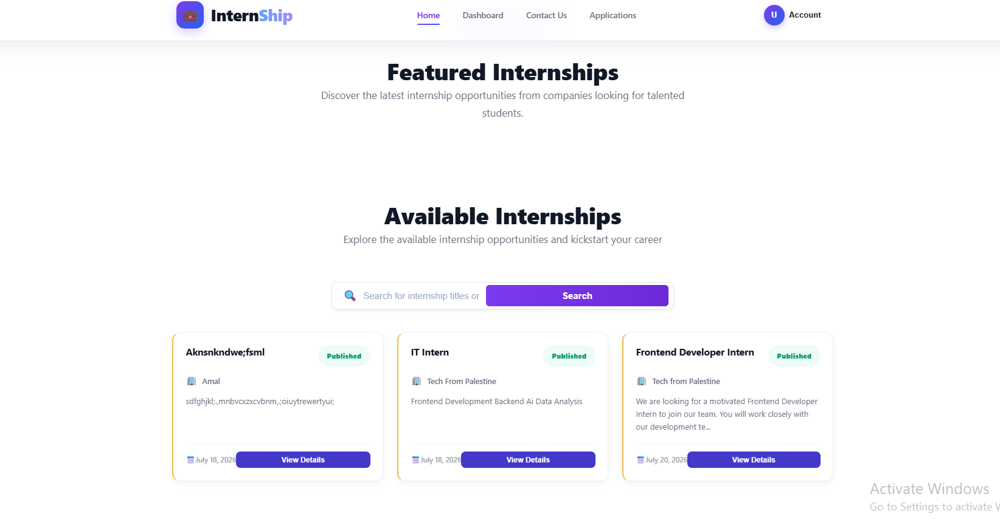

<div align="center">


### Connecting ambitious students with the institutions shaping their future.

A modern, full-stack internship platform that makes it effortless to **discover**, **apply for**, and **manage** internship opportunities — built for both students and institutions.

<br/>

[](https://react.dev/)
[](https://vitejs.dev/)
[](https://dotnet.microsoft.com/)
[](https://www.microsoft.com/sql-server)
[](#-license)
[]()

<br/>

[Features](#-features) •
[Tech Stack](#️-tech-stack) •
[Screenshots](#-screenshots) •
[Getting Started](#️-getting-started) •
[Project Structure](#-project-structure) •
[Roadmap](#-roadmap) •
[Team](#-team)

</div>

---

## 📖 Overview

**Internships Platform** bridges the gap between students seeking real-world experience and institutions looking for fresh talent. Students can browse curated opportunities, apply in a couple of clicks, and track their application status — while institutions get a clean dashboard to post openings, manage listings, and review applicants, complete with profile pictures and CVs.

<br/>

## 🚀 Features

<table>
<tr>
<td width="50%" valign="top">

### 👨‍🎓 For Students

- 🔍 Browse & search available internships
- 🎯 Filter opportunities by relevance
- 📝 Apply to internships in one click
- 📊 Track application status in real time
- 🧑‍💼 Manage a personal profile (photo, CV, bio, GPA)

</td>
<td width="50%" valign="top">

### 🏢 For Institutions

- 📢 Post new internship opportunities
- 🗂️ Manage & edit internship listings
- 👀 Review incoming applications
- ✅ Accept or reject applicants
- 📎 View applicant profiles, photos & CVs

</td>
</tr>
</table>

<br/>

## 🛠️ Tech Stack

<div align="center">

| Layer            | Technologies                                                                                                                                                                                                                                                                                                                                                                                                                                                                                                               |
| ---------------- | -------------------------------------------------------------------------------------------------------------------------------------------------------------------------------------------------------------------------------------------------------------------------------------------------------------------------------------------------------------------------------------------------------------------------------------------------------------------------------------------------------------------------- |
| **Frontend**     |      |
| **Backend**      |                                                                                                                                                                                                                                                                                                |
| **Database**     |                                                                                                                                                                                                                                                                                                                                                                                                    |
| **File Storage** |                                                                                                                                                                                                                                                                                                                                                                                                            |

</div>

<br/>

## 📸 Screenshots

<div align="center">

**🏢 Institution Dashboard**
<br/>
Real-time analytics — applications overview, status breakdown, and quick stats at a glance.
<br/><br/>


<br/><br/>

**👨‍🎓 Student Dashboard**
<br/>
Track applied internships, acceptance status, and discover new opportunities.
<br/><br/>


<br/><br/>

**🌐 Browse Internships**
<br/>
Search and explore featured & available internship opportunities.
<br/><br/>


</div>

<br/>

## 📂 Project Structure

```
Internships-Platform/
│
├── Frontend/
│   ├── src/
│   │   ├── api/            # Axios services (auth, profiles, internships...)
│   │   ├── components/     # Reusable UI components
│   │   ├── pages/           # Route-level pages
│   │   ├── utils/            # Helpers & constants
│   │   └── App.jsx
│   ├── public/
│   └── package.json
│
├── Backend/
│   ├── Controllers/         # API endpoints
│   ├── Models/                # Entity models
│   ├── Services/              # Business logic (file storage, auth...)
│   └── Program.cs
│
└── README.md
```

<br/>

## ⚙️ Getting Started

### Prerequisites

- [Node.js](https://nodejs.org/) 18+
- [.NET SDK](https://dotnet.microsoft.com/download) 8.0+
- SQL Server (local or remote instance)

### 1️⃣ Clone the repository

```bash
git clone https://github.com/amoolsamir332007-svg/Internships-Platform.git
cd Internships-Platform
```

### 2️⃣ Set up the Frontend

```bash
cd Frontend
npm install
npm run dev
```

The app will be available at `http://localhost:5173` by default.

### 3️⃣ Set up the Backend

```bash
cd Backend
dotnet restore
dotnet run
```

The API will be available at `https://localhost:5001` (or as configured in `launchSettings.json`).

> ⚠️ Don't forget to configure your database connection string in `appsettings.json`, and — if using cloud file storage — your storage provider credentials as well.

<br/>

## 🗺️ Roadmap

- [ ] 🔔 Real-time notifications
- [ ] 💬 In-app chat between students and institutions
- [ ] ✉️ Email verification
- [ ] 📅 Interview scheduling
- [ ] 🛡️ Admin dashboard

<br/>

## 👩‍💻 Team

<div align="center">

|                 |                 |                   |
| :-------------: | :-------------: | :---------------: |
| **Besan Naser** | **Amal Hamdan** | **Alaa Alzammar** |

</div>

<br/>

## 📄 License

This project is licensed under the **MIT License** — feel free to use, modify, and build upon it.

<br/>

<div align="center">

### ⭐ If you like this project, don't forget to give it a Star!

<sub>Built with 💜 by students, for students.</sub>

</div>
